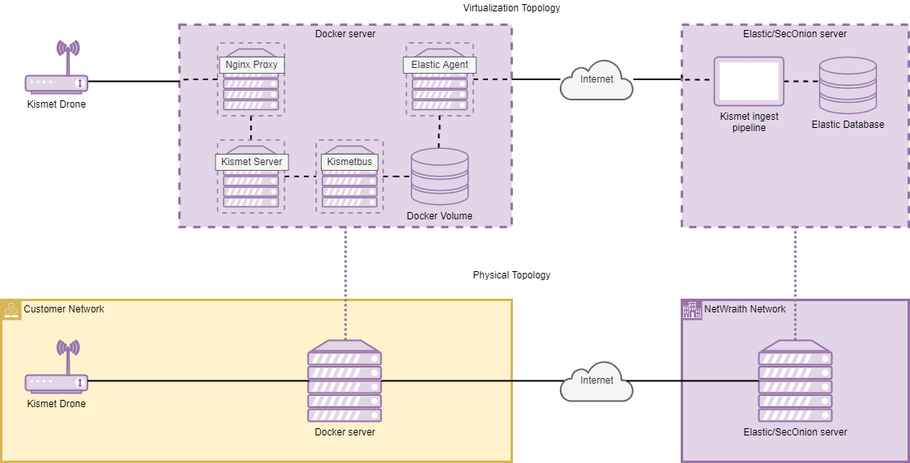
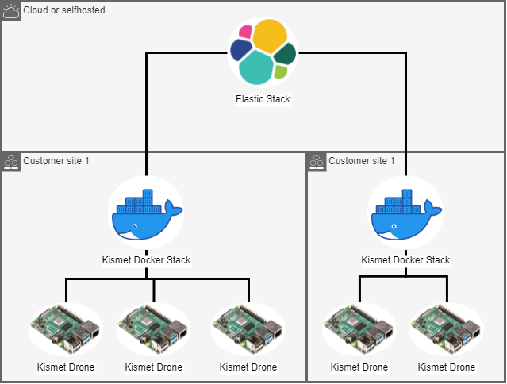

# NetWraith 
Wireless intrusion detection using Kismet and ELK Stack or Security Onion 2.4
NetWraith is a project that aims to integrate the WIDS functionality of Kismet into Elastic. Every component is containerized apart from the kismet drones and uses a mix of custom built containers and prebuilt containers.  Netwraith is meant to be installed alongside an existing wireless network and should not require any modifications to the existing network other than making sure the new components can access each other and the internet. 


# Compatability
Custom containers are built for AMD64 and ARM64(/v8). The project has been tested and confirmed to be working on *Docker Desktop for Windows 10* and on *Raspberry Pi 4's* running *Debian Bookworm*.

# Roadmap/Todo
- [ ] Automate installation and onboarding of remote capture devices.
- [x] Allow kismetbus to connect via docker dns.
- [ ] CD part of CI/CD pipeline to autodeploy on testserver.
- [ ] ~~Possibly replace kismetbus with a HTTP endpoint integration from elastic?~~ (Currently (2023) there is no Elastic integration for websockets)
- [ ] Way to visualize active access-points.
- [ ] Add the device that spotted the alert to the alert message.
- [ ] Drone installation guides for other operating systems.
- [x] Add event severity fields to exported alerts.
- [ ] Make the generated certificates for the proxy work regardless of hostname.
- [ ] Uptime monitoring server.
- [ ] Uptime monitoring drones.
- [x] Add kismet alerts to elastic security.
- [x] Fix drones not connecting.

# Known issues
- [ ] Kismet APSPOOF alert doesn't seem to work.
- [x] ~~Kismet eventbus ALERT type doesn't seem to return any data.~~ (Fixed, seems to have been a skill issue on my side)

# Requirements
NetWraith consists of multiple parts running on multiple machines. The minimal required setup is as follows:
- Docker server with compose installed.
- Functional Elastic stack with Kibana and Fleet or Security Onion 2.4 Manager-Searchnode. (SO2.4 doesn't support Elastic security alerts.) (Final product tested with Elastic Stack version 8.11.1 in docker, used this external project: https://github.com/peasead/elastic-container)
- Separate machine used as remote capture device (referred to as drone) running a version of Debian Bookworm with a monitor mode capable wireless network card. (Tested with a Raspberry Pi 4B with a USB wifi dongle)
- Basic knowledge of ELK stack functionality, specifically the creation of ingest-pipelines, index/component templates and integrations/agent policies.

Technically it should be possible to just run the Kismet and Nginx containers if no integration with ELK stack/SO is required (just delete the other services from the docker compose file).

# Installation
## What will be installed?
Because of the complexity of the project a general idea of how the systems work and connect is required. This is the current design:



The proposed implementation makes use of one central ELK stack (Single server, Cluster or Container stack). On the ELK stack all data will be gathered and security analyst will login and review alerts and logs that have triggered.

Separately, for every customer, there will be a docker host that can be implemented on premise containing at least the 4 containers described in the picture above. Additionally every customer location will have at least 1 but preferably multiple kismet drones installed throughout the building. These will connect to the kismet container on the docker server via the nginx proxy over HTTPS. The Kismetbus container will constantly connect to the Kismet containers websocket connection to retrieve logs including security alerts. These are then saved to a file that is mapped to a docker volume. The elastic agent container is mapped to the same volume and will constantly export these logs towards the ELK stack.

On the ELK stack (in this case the version installed by SO2.4) there will be a pipeline configured that transforms the incoming data which can then be used in a dashboard or for alerting.

The idea is to be able to run multiple kismet servers, one per location, that each have multiple drones listening to wifi traffic. These servers then connect to a central Elastic server/cluster as shown in the diagram below.



## Configuring the ELK stack.
Installed using https://github.com/peasead/elastic-container. This comes down to having Elasticsearch, Kibana and Fleet.

### Integration/agent policy
To later be able to link the agent to the server an agent policy will need to be created containing a custom logs integration. This integration can be imported alongside the agent policy found in `/elastic/elastic-backups/elastic-agent.yml`.

### Pipeline
An ingest pipeline will need to be created using the config found in `elastic\elastic-backups/kismetpipeline.json`. 

### Component template
Create a component template using: `elastic/elastic-backups/kismetcomponenttemplate.json`.

### Index template
Create and index template using: `elastic/elastic-backups/kismetindextemplate.json`.

### Alerting rules
Create a new rule and import: `elastic/elastic-backups/rules_export.ndjson`.

### Dashboard
Import the following dashboard: `elastic/elastic-backups/dashboardwids.ndjson`.

## Kismet docker stack
### Clone repository to docker host
```bash
cd ~/
git clone https://github.com/BumbleB-NL/NetWraith.git
```
Also rename the `kismet_site.config.example` file to `kismet_site.config` (found in `server/kismet/`). Configuration changes for kismet can be added to this file.

### Generate self-signed SSL certificate for the HTTPS proxy
To generate a self-signed certificate edit and used the following oneliner:
```bash
cd ~/NetWraith/server/nginx/certs
openssl req -x509 -nodes -days 36500 -newkey rsa:8192 -keyout cert.key -out cert.crt -subj "/C=NL/ST=Province/L=City/O=Organization/OU=CyberSecurity/CN=netwraith-host"
```
The `CN` configured here will be needed later when adding Kismet drones. The `cert.crt` file will be needed for the Kismet drone aswell.

### Running the docker compose components
Before being able to run a few environment variables need to be set. This can be done by editing `server/.env` (rename `server/.env.example`). 

The following environment variables should be set in the `.env` file.

- `KISMET_SERVER_APIKEY`: needs to contain a readonly Kismet API key. This key is used to connect `kismetbus` to the `kismet_server` API (Manually generate key in the Kismet webgui after running everything at least once).
- `FLEET_ENROLLMENT_TOKEN`: set this to the enrollment token for the newly created Elastic agent policy.
- `FLEET_URL`: set this to the address of the Elastic fleet server, usually `https://<ipOrHostnameElastic>:8220`.
- `FLEET_INSECURE` set this to true if using a self-signed certificate. (Usually the case in test environments)

After setting up the environment variables the containers can be started using `sudo docker compose up`. All containers except `kismetbus` should be continuously running.

Navigate to `https://<dockerhostip>:2501` (Kismet webgui) and create a username and password. Next go to `settings>apikeys` and generate the following api keys (names dont matter):
- `eventbus` with role `readonly` (Paste this key in the `server/.env` file for `KISMET_SERVER_APIKEY`).
- `datasource` with role `datasource` (this will be used later when adding Kismet drones).

After adding the `eventbus` API key to the `server/.env` file run `docker compose up -d`. All containers should now be running continuously (not restarting every second).

## Adding kismet drones
### Debian bookworm on RPi4
Clone the repo
```bash
cd ~/
git clone https://github.com/BumbleB-NL/NetWraith.git
cd ~/NetWraith
```

Map the builtin wireless adapter to wlan0 (this won't be used by kismet as it doesn't support monitor mode):
!!! Make sure no external wifi adapters are connected during this step !!!
```bash
sudo chmod +x drone/mapwlan0.sh
sudo drone/mapwlan0.sh
```
After succesfully mapping the mac address of the builtin adapter to wlan0 the external wireless card can be connected to the RPi4.

Update, upgrade, and install remote capture from Kismet repo along with ufw and netcat:
```bash
sudo apt update -y
sudo apt upgrade -y
wget -O - https://www.kismetwireless.net/repos/kismet-release.gpg.key --quiet | gpg --dearmor | sudo tee /usr/share/keyrings/kismet-archive-keyring.gpg >/dev/null
echo 'deb [signed-by=/usr/share/keyrings/kismet-archive-keyring.gpg] https://www.kismetwireless.net/repos/apt/release/bookworm bookworm main' | sudo tee /etc/apt/sources.list.d/kismet.list >/dev/null
apt update -y
sudo apt install -y kismet-capture-linux-wifi ufw
```

Enable firewall and allow ssh (to not lock yourself out):
```bash
sudo ufw allow proto tcp to 0.0.0.0/0 port 22
echo "y" | sudo ufw enable
sudo usermod -aG kismet $user
```

Copy files from repo:
```bash
sudo cp ~/NetWraith/drone/kismet-drone.service /etc/systemd/system/kismet-drone.service
cp ~/NetWraith/drone/netwraith.env.example ./netwraith.env
```

Make sure to copy the `cert.crt` file that was generated earlier to the home folder on the Kismet drone:
```bash
scp <user>@<docker-host>:~/NetWraith/server/nginx/certs/cert.crt ~/cert.crt
```

Edit the following variables in the netwraith.env file:
- `HIVE_HOSTNAME`: make sure this is the same as the `CN` used when generating the certificate files.
- `HIVE_PORT`: the port the nginx proxy uses.
- `HIVE_API_KEY`: the `datasource` api key generated earlier.
- `DRONE_SSL_CERT_PATH`: path where the `cert.crt` file is found.
- `DRONE_CAPTURE_SOURCE`: the name of the wireless adapter Kismet should use for capturing (usually wlan1).

Make sure the hostname is mapped to the dockerhosts ip address:
```bash
echo "<dockerhostip>     <CNasconfiguredbefore>" | sudo tee -a /etc/hosts
```

Reload the systemctl daemon and enable/start the remote capture service:
```bash
sudo systemctl daemon-reload
sudo systemctl enable --now kismet-drone.service
sudo systemctl restart kismet-drone.service networking
```

The drone should now be connected to the Kismet server and data should be coming in (check `settings>datasources` in the Kismet webgui).

### Other OS
Will be added later...
(Same steps should apply, just make sure to install the correct package from the Kismet repo https://www.kismetwireless.net/packages/).
